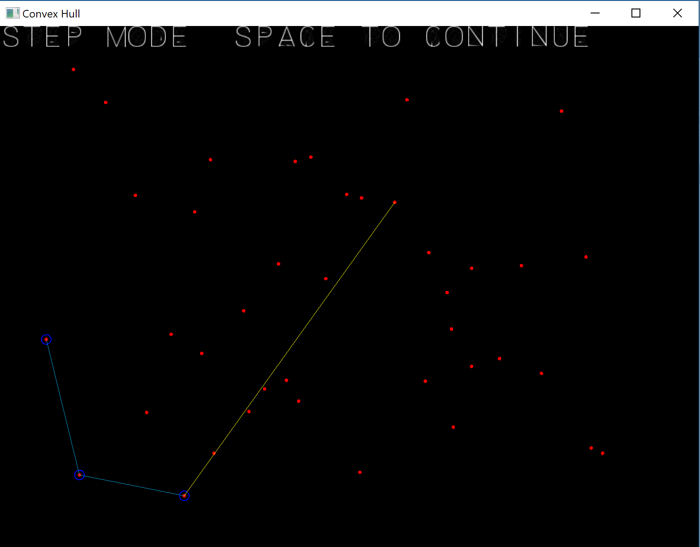

# jarvis-march-convex-hull
Implementation of the Jarvi's March (Gift Wrapping) algorithm. Visualization (single step visible) and performance measurement.

1. performance optimized with time measurement
2. visual single step mode with SFML https://www.sfml-dev.org/ (Version SFML-2.3.2)

## Two types of execution:

Testmode:
*ConvexHull.exe −−stepbystep 0 −−points 2000000*
Visualization:
*ConvexHull.exe −−stepbystep 1 −−points 40*

In the testmode random numbers are generated and should show the weakness of the algorithm if one axis has constant values:

Algorithm           |   Runtime [s] for n=2*10^6
--------------------|------------------------------
Random x and y      |       0.044
Random x and constant y |   0.454
Random y and constant x |   0.436#

## Visualization

